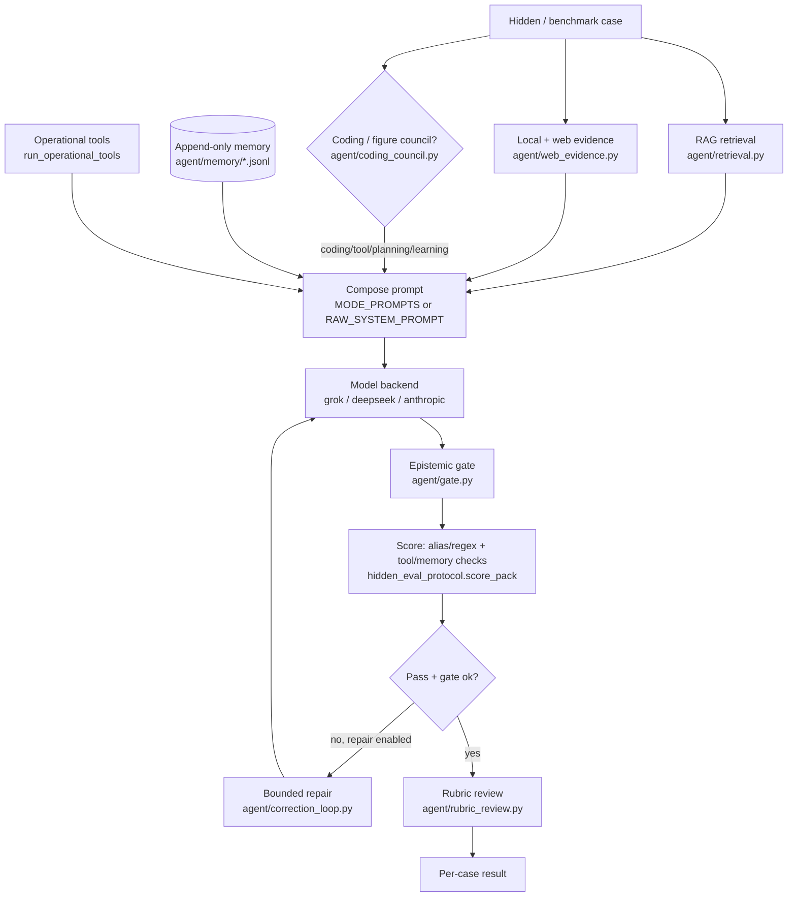
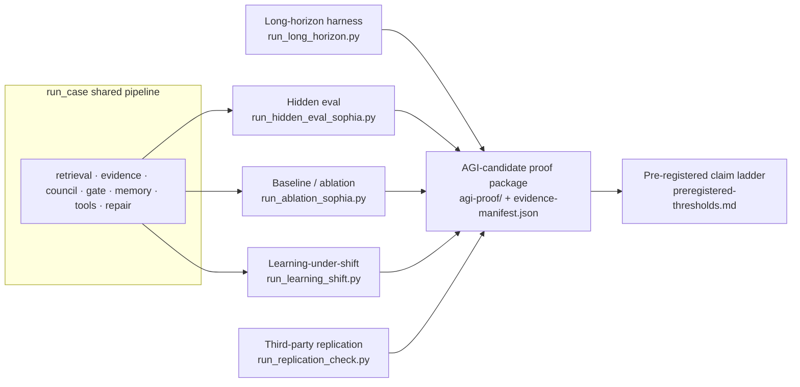

# Sophia Architecture — One Flow

This diagram ties the Sophia subsystems — retrieval (RAG), council, epistemic
gate, append-only memory, operational tools (a fixed tool-dispatch step, not a
general executor), hidden evaluation, baseline/ablation, and the AGI-candidate
proof package — into a single flow. It satisfies the Architecture Claim item in
[`agi-proof/TODO.md`](../../agi-proof/TODO.md).

Every component below is a discrete, suppressible step in the shared per-case
pipeline `run_case()` in
[`tools/run_hidden_eval_sophia.py`](../../tools/run_hidden_eval_sophia.py), which
is why the baseline/ablation runner can toggle each one independently.

## Per-case reasoning pipeline

## Evidence pipeline (Level 2 → Level 3)

## Component → file map

| Component | Implementation | Ablation flag |
|---|---|---|
| RAG retrieval | `agent/retrieval.py` | `use_kb` |
| Local/web evidence | `agent/web_evidence.py` | `use_evidence` |
| Coding/figure council | `agent/coding_council.py` | `use_council` |
| Epistemic gate | `agent/gate.py` | `use_gate` |
| Append-only memory | `agent/memory.py`, `run_learning_probe` | `use_memory` |
| Operational tools | `run_operational_tools` | `use_tools` |
| Bounded repair | `agent/correction_loop.py` | `allow_repair` |
| Prompt discipline | `agent/prompts.py` (`MODE_PROMPTS`) vs `RAW_SYSTEM_PROMPT` | `raw_system` |

## Proof harnesses

| Harness | Tool | Produces |
|---|---|---|
| Hidden eval | `tools/run_hidden_eval_sophia.py` | `agi-proof/benchmark-results/*.public-report.json` |
| Baseline/ablation | `tools/run_ablation_sophia.py` | `agi-proof/baseline-ablation/ablation-deltas-*.public-report.json` |
| Learning-under-shift | `tools/run_learning_shift.py` | `agi-proof/learning-under-shift/shift-result-*.public-report.json` |
| Long-horizon autonomy | `tools/run_long_horizon.py` | `agi-proof/long-horizon-runs/*.public-report.json` |
| Third-party replication | `tools/run_replication_check.py` | `agi-proof/third-party-replication/replication-check-*.json` |
