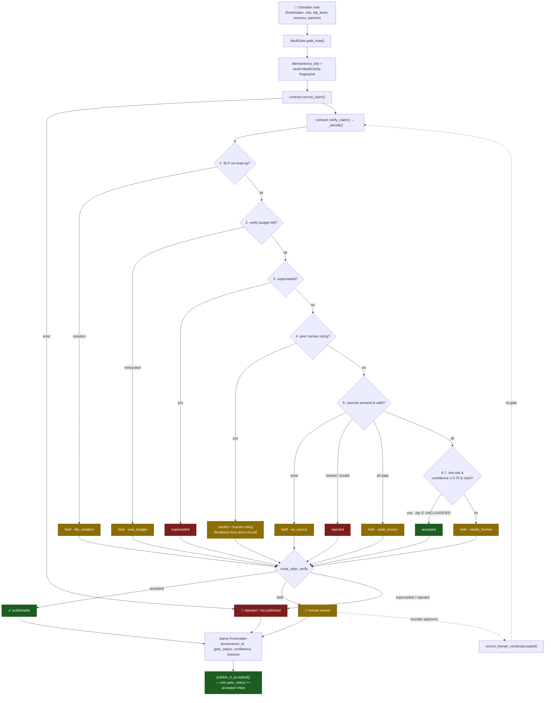
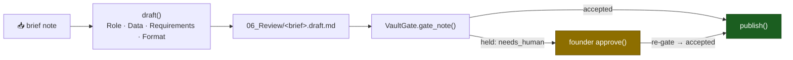

# Vault → Contract Gate Workflow

> **Generated file.** Do not hand-edit — run `python tools/vault_workflow_diagram.py`.
> The routing is derived from the code (`route_after_verify` + `service._decide`),
> so the diagram cannot drift from what the gate actually does.

**View it on your iPhone two ways:**

1. **GitHub app / mobile Safari** — open this file in the repo; GitHub renders the
   Mermaid blocks below into diagrams.
2. **Obsidian mobile** — copy this note into your vault (or run
   `python tools/vault_workflow_diagram.py --out /path/to/your/Vault/`); Obsidian
   renders Mermaid natively, so you get the interactive diagram in the app.

## 1 · Note lifecycle — record → verify → route → publish

Every Obsidian note is a *claim*. `VaultGate.gate_note()` records it, runs the
fail-closed `_decide` rule ladder, routes the verdict, and stamps the result back
into the note's frontmatter. **A note ships only when `gate_status == accepted`.**

### Verdict → route (the single authority: `route_after_verify`)

| Verdict | `_decide` branch | Goes to |
|---------|------------------|---------|
| `accepted` | low-risk, high-confidence, cited | **publishable** |
| `held` | blp_violation | **human review** |
| `held` | over_budget | **human review** |
| `held` | no_source | **human review** |
| `held` | stale_source | **human review** |
| `held` | needs_human | **human review** |
| `superseded` | successor exists | **rejected / not published** |
| `rejected` | source refuted / invalid | **rejected / not published** |

Only `accepted` is publishable. `held` waits for a founder ruling
(approve-by-exception); once approved, the human verdict is recorded and the note
is re-gated — the preference feedback loop then short-circuits it to `accepted` on
every future pass. `superseded` / `rejected` never publish.

## 2 · Copywriting pipeline over the vault

`CopywritingPipeline` (`sophia_contract/pipelines/copywriting.py`) is the same gate
applied to a bespoke-voice drafting loop: a brief note becomes a gated draft in
`06_Review/`, and only an accepted (or founder-approved) draft is published.

## Keeping this note honest

`tests/test_vault_workflow_diagram.py` regenerates this file and fails CI if the
committed copy drifts from the generator — the same discipline the repo uses for
its other generated artifacts.
