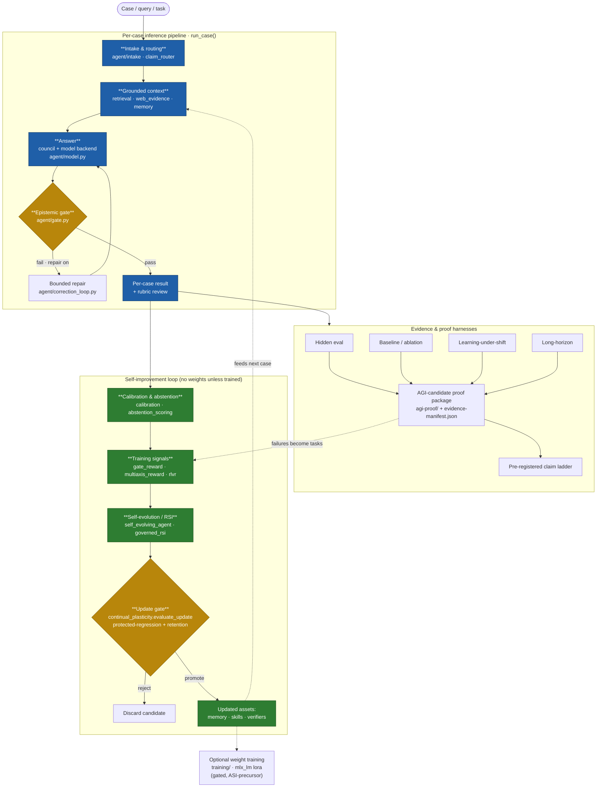

# Sophia — Master Workflow Flowchart

**Purpose.** One master chart that ties every Sophia subsystem together, plus links to the
per-subsystem charts that expand each block. Built from the actual code in the working clone (the
`run_case()` pipeline in `tools/run_hidden_eval_sophia.py`, the `agent/` module wiring, and
`docs/09-Agent/Sophia-Architecture.md`) — not from a hand-drawn map. Every node names a real file.

**How to read it.** The spine is the **per-case inference pipeline** (left→right): a case enters,
gathers grounded context, is answered by a frozen model, then passes an epistemic gate before
producing a result. Around that spine sit two slower loops — the **evidence/proof harnesses** that
measure the pipeline, and the **self-improvement loop** that turns measured failures into gated
updates (memory, skills, verifiers — never raw weights unless explicitly trained).

## Master chart

## Subsystem charts (each block above, expanded)

| # | Subsystem | Chart | Lead modules |
|--:|-----------|-------|--------------|
| 1 | Intake & routing | [`01-Intake-Routing.md`](01-Intake-Routing.md) | `agent/intake`, `claim_router.py`, `swarm_router.py` |
| 2 | Grounded context (RAG + evidence + memory) | [`02-Grounded-Context.md`](02-Grounded-Context.md) | `retrieval.py`, `web_evidence.py`, `realtime_grounding.py` |
| 3 | Council & answer generation | [`03-Council-Answer.md`](03-Council-Answer.md) | `coding_council.py`, `council_deliberate.py`, `model.py` |
| 4 | Epistemic gate & verification | [`04-Epistemic-Gate.md`](04-Epistemic-Gate.md) | `gate.py`, `verifiers.py`, `claim_router.py` |
| 5 | Calibration & abstention | [`05-Calibration-Abstention.md`](05-Calibration-Abstention.md) | `calibration.py`, `abstention_scoring.py`, `selective_risk.py` |
| 6 | Self-evolution / RSI + update gate | [`06-Self-Evolution-RSI.md`](06-Self-Evolution-RSI.md) | `self_evolving_agent.py`, `governed_rsi.py`, `continual_plasticity.py` |
| 7 | Evidence & proof harnesses | [`07-Proof-Harnesses.md`](07-Proof-Harnesses.md) | `run_hidden_eval_sophia.py`, `run_ablation_sophia.py` |
| 8 | Weight-training path (SFT/DPO/RLVR → MLX LoRA) | [`08-Training-Path.md`](08-Training-Path.md) | `training/*.jsonl`, `mlx_lm lora`, `run_rlvr.py` |

**Ground-truth note.** These charts were built by reading the working clone at
`/Users/tom/Documents/GitHub/sophia-agi` — branch `feat/oscillatory-crosspollination` @ `4f1059a0`,
which carries 388 uncommitted local modifications (including `Sophia-Architecture.md` itself), so this
tree may differ from any pushed commit. For reference, `origin/main` was at `2cfa3c63` (post-PR #331)
at build time; the node labels were **not** verified against that commit — they cite real files in the
working tree. The dotted edges are the two feedback loops (promoted assets re-enter the next case;
measured failures become training signals). The optional weight-training node is dashed because it is
the one step that changes model weights — everything else improves behavior without touching them,
which is the repo's core design stance.