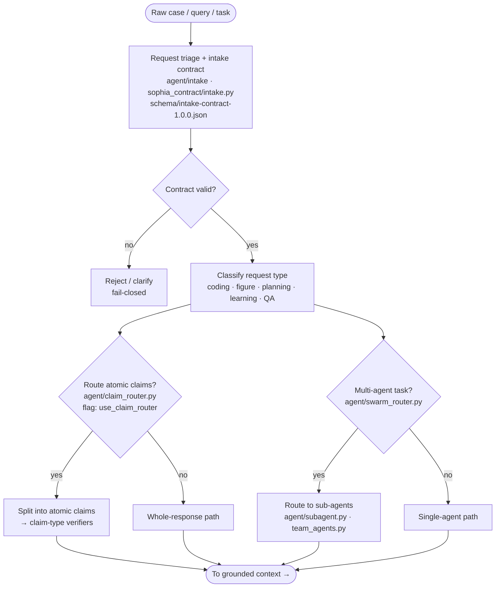

# 1 · Intake & Routing

**Role in the master flow.** The front gate: turns a raw case into a typed, contract-checked request
and decides which downstream paths (retrieval, council, claim-verification) it needs. Ablation flag
`use_intake`. Suppressing it sends the raw query straight to context-gathering.

**Modules:** `agent/intake/`, `agent/claim_router.py`, `agent/swarm_router.py`, `agent/subagent.py`,
`agent/team_agents.py`. **Contract:** `schema/intake-contract-1.0.0.json`.

**Thesis note.** The intake contract is what makes every downstream step *suppressible and
measurable* — it stamps the request shape so the ablation runner can toggle each pipeline stage
independently. That toggle-ability is the basis of the whole baseline/ablation evidence story.