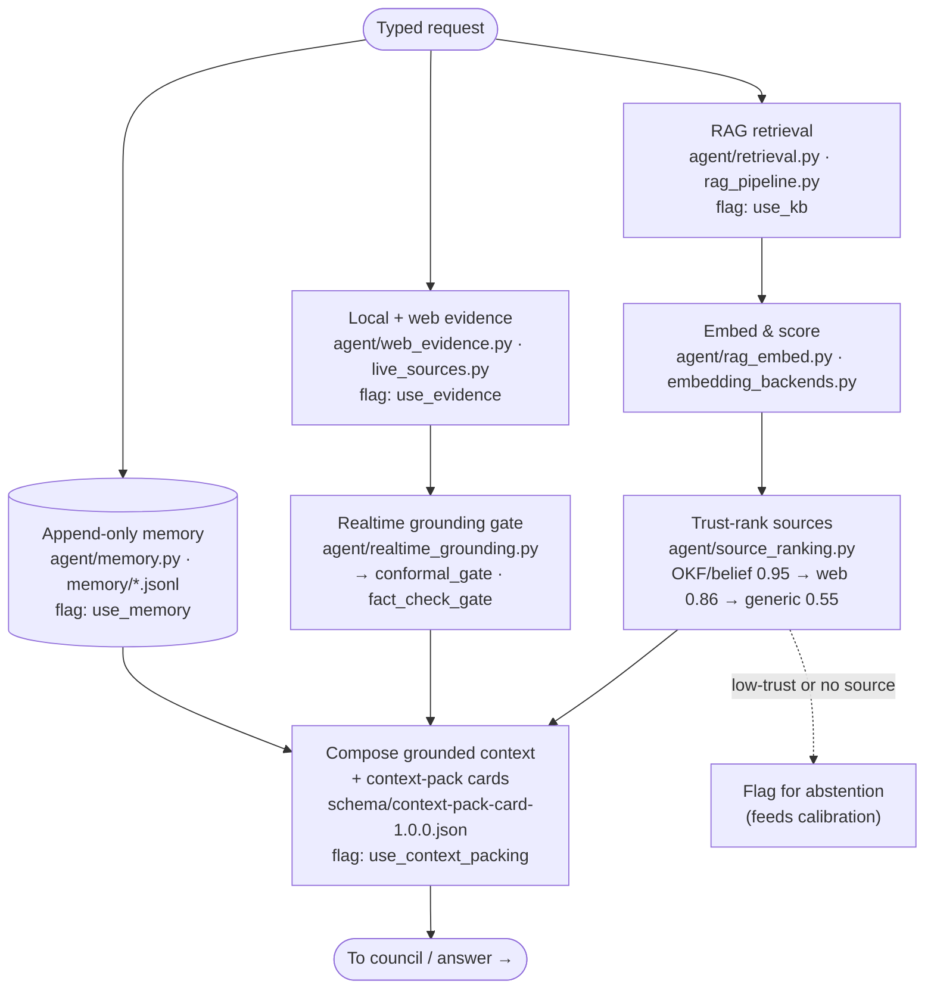

# 2 · Grounded Context (RAG + Evidence + Memory)

**Role in the master flow.** Assembles the grounded context the model answers from: retrieved
passages, local/web evidence, and prior memory — each with a provenance/trust tag. Ablation flags
`use_kb` (retrieval), `use_evidence` (evidence), `use_memory` (memory).

**Modules:** `agent/retrieval.py`, `rag_pipeline.py`, `rag_embed.py`, `rag_local_embed.py`,
`embedding_backends.py`, `web_evidence.py`, `live_sources.py`, `source_ranking.py`,
`grounded_confidence.py`, `realtime_grounding.py`, `memory.py`.

**Thesis note.** Two traps worth stating in a methods chapter: (1) `rag_local_embed.py` is *also*
hash-based (`local-hash-v1`), so it is not a semantic upgrade over the lexical embedder — confirm the
live backend via `agent.vector_store.embedding_backend_id()`. (2) Source trust rank is deterministic
(`agent/source_ranking.py`), which is what lets provenance become a *weight* on downstream loss (see
the untapped-training W3 direction), not just a display tag.