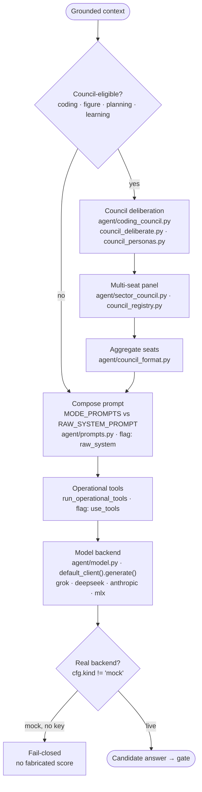

# 3 · Council & Answer Generation

**Role in the master flow.** Produces the candidate answer. For coding/figure/planning cases a
multi-seat **council** deliberates before the model call; otherwise the composed prompt goes straight
to the frozen model backend. Ablation flag `use_council`.

**Modules:** `agent/coding_council.py`, `council_deliberate.py`, `council_personas.py`,
`council_registry.py`, `sector_council.py`, `council_format.py`, `prompts.py`, `model.py`,
`subagent.py`, `team_agents.py`.

**Thesis note.** Two facts a reviewer will check: the real adapter is
`agent.model.default_client(spec).generate(system, user) -> ModelResult` (not a `complete(prompt)`
call), and `agent.model._auto_provider()` returns `"mock"` with no API key — mock `.generate()`
fabricates text at `ok=True`. Any measured claim must assert `cfg.kind != "mock"`. Council catch-rate
(1.0 vs 0.27 monolith) in the repo's reports is on *stub* seats — real trained discipline adapters are
a named open gap.