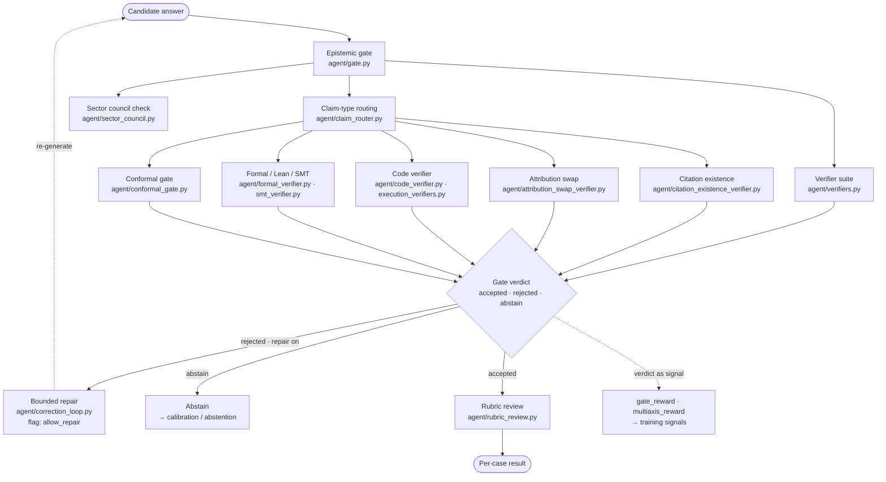

# 4 · Epistemic Gate & Verification

**Role in the master flow.** The heart of the repo: after generation, the answer must pass an
**epistemic gate** before it becomes a result. The gate composes many verifiers (claim-type,
citation, code, formal/Lean, conformal) and can send a failing answer back for bounded repair.
Ablation flag `use_gate`. This is the largest subsystem — 49 `agent/` modules.

**Modules (subset of 49):** `gate.py`, `gate_reward.py`, `gate_feedback.py`, `verifiers.py`,
`claim_router.py`, `conformal_gate.py`, `constitutional_gate.py`, `consequence_gate.py`,
`honeypot_gate.py`, `fact_check_gate.py`, `citation_existence_verifier.py`,
`attribution_swap_verifier.py`, `code_verifier.py`, `execution_verifiers.py`, `formal_verifier.py`,
`smt_verifier.py`, `deontic_verifier.py`, `layered_verifier.py`, `rubric_review.py`,
`correction_loop.py`.

**Thesis note.** The gate verdict is three-way (`accepted` / `rejected` / `abstain`), and the same
verdict is the seed for the training-signal path (`gate_reward.reward()`). That dual use — verdict as
inference-time gate **and** as a reward — is the bridge from "measured epistemics" to "learned
epistemics" (the untapped-training W1/W2 directions). `gate_reward` deliberately drops the question,
so as a raw reward it cannot tell abstain-on-answerable from abstain-on-trap — a known reward-hacking
surface worth naming.