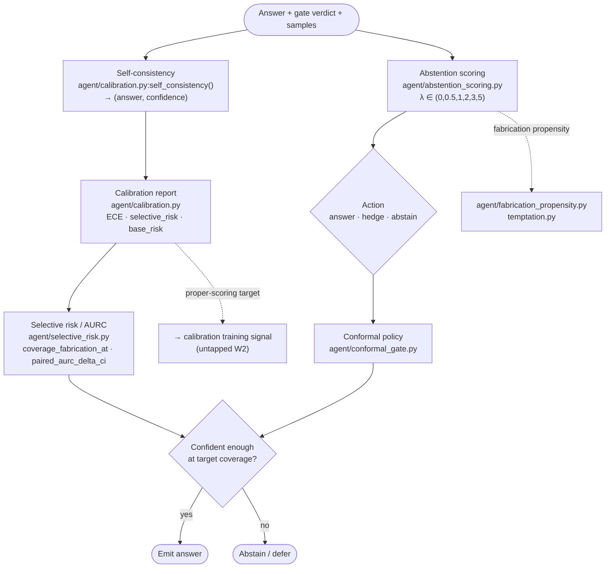

# 5 · Calibration & Abstention

**Role in the master flow.** Turns gate verdicts and confidence signals into a calibrated
answer/abstain decision, and measures whether the system knows what it doesn't know. This is where the
repo's validated headline result lives (self-consistency selective prediction). Feeds the
self-improvement loop with the honesty signal.

**Modules:** `agent/calibration.py`, `abstention_scoring.py`, `selective_risk.py`, `conformal_gate.py`,
`fabrication_propensity.py`, `temptation.py`, `grounded_confidence.py`, `semantic_entropy_probe.py`,
`competence_model.py`.

**Thesis note.** This subsystem is measurement-only today: `calibration.py`,
`abstention_scoring.py`, and `selective_risk.py` contain **no differentiable loss** — they score, they
don't train. `abstention_scoring.py` cites Kalai et al. (*Why Language Models Hallucinate*) on the
binary-scoring incentive to guess (repo's own citation, not independently verified here). The largest
untapped lever in the whole repo is turning these proper-scoring metrics into an actual training
objective (W2) — the measurement→learning gap.