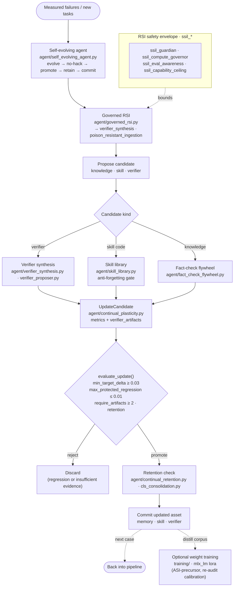

# 6 · Self-Evolution / RSI + Update Gate

**Role in the master flow.** The slow loop: turn measured failures into candidate improvements
(knowledge, skills, verifiers), then **gate every promotion** through a protected-regression +
retention check so the system improves without catastrophic forgetting — and without touching weights
unless an explicit training run is invoked. 37 `agent/` modules, incl. the whole `ssil_*` safety
family.

**Modules:** `self_evolving_agent.py`, `governed_rsi.py`, `continual_plasticity.py`,
`continual_retention.py`, `cls_consolidation.py`, `fact_check_flywheel.py`, `verifier_synthesis.py`,
`verifier_proposer.py`, `skill_library.py`, `habit_strength.py`, `plasticity_probe.py`, and the
`ssil_*` family (`ssil_guardian`, `ssil_compute_governor`, `ssil_eval_awareness`,
`ssil_capability_ceiling`, `ssil_moral_parliament`, …).

**Thesis note.** `evaluate_update()` is the repo's central safety primitive — a promotion is accepted
only if it clears a target-improvement floor **and** does not regress any protected metric beyond
tolerance, backed by ≥2 verifier artifacts. Today this loop improves *assets* (memory/skills/
verifiers), never weights. The dashed `WEIGHTS` edge is the one move that crosses into actual model
training (the SkillOpt-style skill→weight distillation, and W-series live runs) — and it is precisely
where the abstention the gate enforced can be un-learned, so post-distillation calibration re-audit is
mandatory.