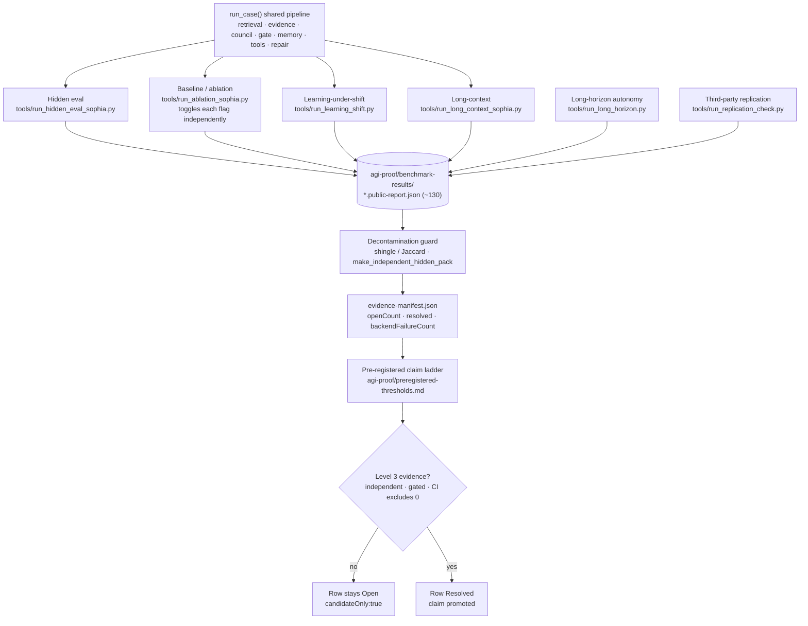

# 7 · Evidence & Proof Harnesses

**Role in the master flow.** The measurement layer. Every harness drives the *same* `run_case()`
pipeline with different toggles/datasets, writes a `*.public-report.json`, and feeds the AGI-candidate
proof package and its pre-registered claim ladder. This is what keeps claims honest: nothing is a
result until a harness produces a decontaminated, gated report.

**Tools:** `run_hidden_eval_sophia.py`, `run_ablation_sophia.py`, `run_learning_shift.py`,
`run_long_context_sophia.py`, `run_long_horizon.py`, `run_replication_check.py`,
`make_independent_hidden_pack.py`, plus the `eval_*.py` / `calibrate_*.py` family.

**Thesis note.** The design invariant worth foregrounding: every subsystem in charts 1–6 is a
*suppressible step* in one shared `run_case()`, which is exactly why the ablation runner can measure
each component's marginal contribution. Reports carry `candidateOnly` / `level3Evidence` /
`canClaimAGI` flags; a claim is promoted on the ladder only when an independent, decontaminated, gated
harness clears a pre-registered threshold with a CI excluding zero. This is the repo's answer to "how
do you prove an AGI-candidate claim without fooling yourself."