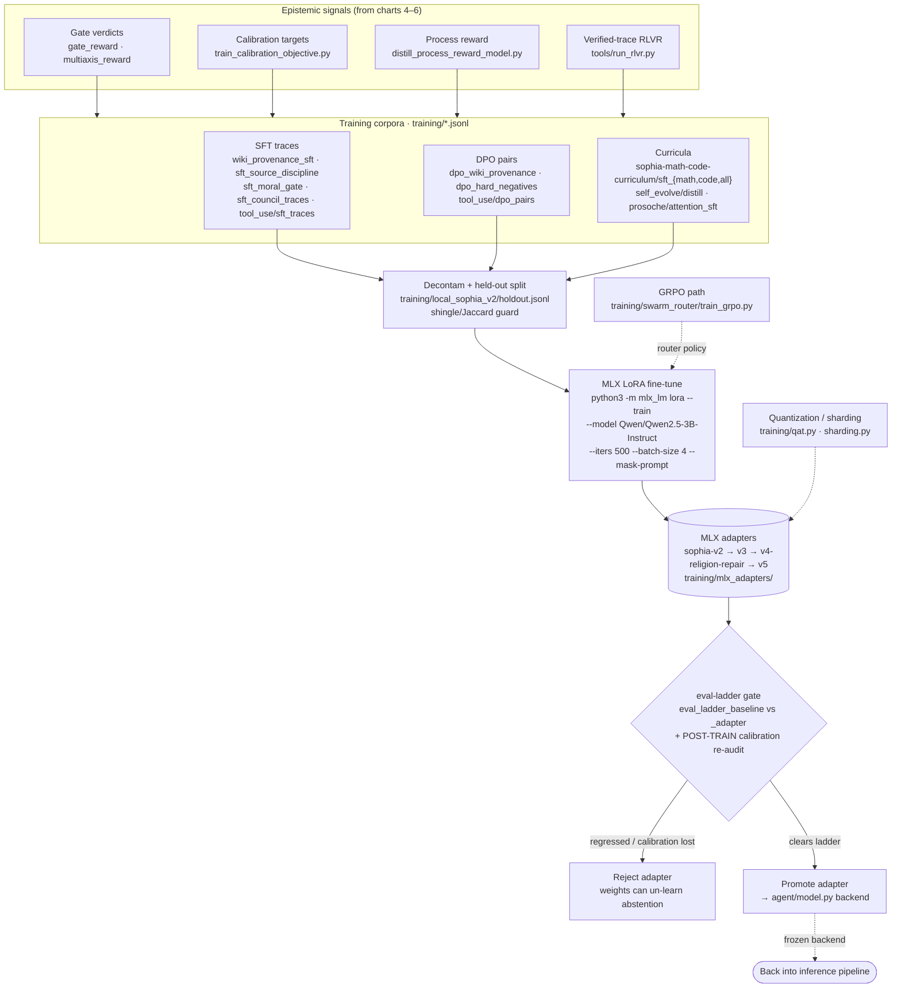

# 8 · Weight-Training Path (SFT / DPO / RLVR → MLX LoRA)

**Role in the master flow.** The one path that changes **model weights** — the dashed `WEIGHTS` node
in the master chart. Everything in charts 1–7 improves behavior without touching weights; this
subsystem is where measured epistemic signals (gate verdicts, calibration, provenance) are distilled
into training corpora and folded into a frozen base model via MLX LoRA. It is the ASI-precursor loop,
and the point where inference-time safety must be re-audited post-training.

**Files:** corpora under `training/` (`wiki_provenance_sft.jsonl`, `moral_gate_sft.jsonl`,
`local_sophia_v2/*.jsonl`, `sophia-math-code-curriculum/*.jsonl`, `tool_use/*.jsonl`,
`self_evolve/distill.jsonl`, `prosoche/attention_sft.jsonl`); code `training/qat.py`,
`training/sharding.py`, `training/swarm_router/train_grpo.py`; adapters `training/mlx_adapters/sophia-v2…v5`;
eval gates `training/local_sophia_v2/eval_ladder_*.json`; reward tools
`tools/run_rlvr.py`, `tools/distill_process_reward_model.py`, `tools/train_calibration_objective.py`.

**Thesis note.** Three points a training-chapter reviewer will want stated: (1) the base is a **frozen
Qwen2.5-3B-Instruct** adapted only by LoRA — sophia does not pre-train. (2) The corpora are the
epistemic loop's *output* (provenance discipline, hard-negative abstention, moral-gate, council
traces) turned into supervision — this is the concrete measurement→learning bridge the W-series
proposes to complete. (3) The **post-training calibration re-audit** (the `EVALGATE` node) is not
optional: distilling gated *behaviors* into weights removes the inference-time gate that made them
safe, so an adapter must be re-checked for abstention/calibration regression before promotion, under
the same `candidateOnly` / `canClaimAGI:false` discipline as every other harness.