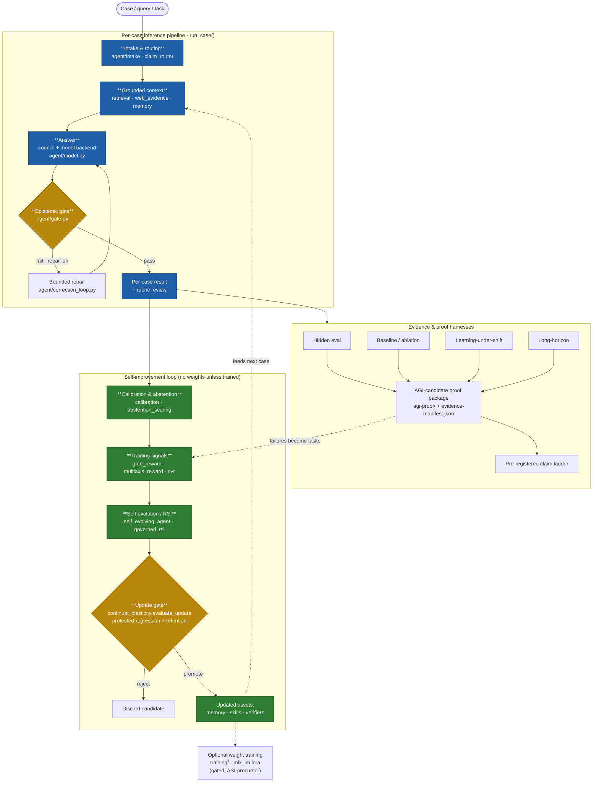
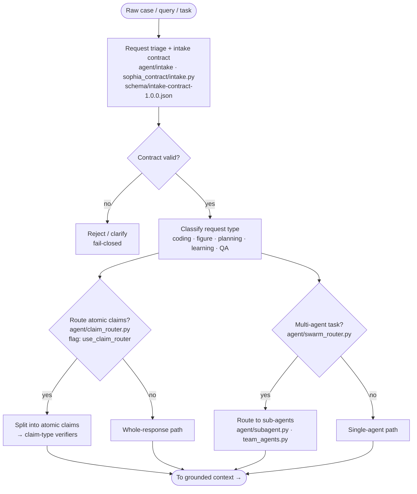
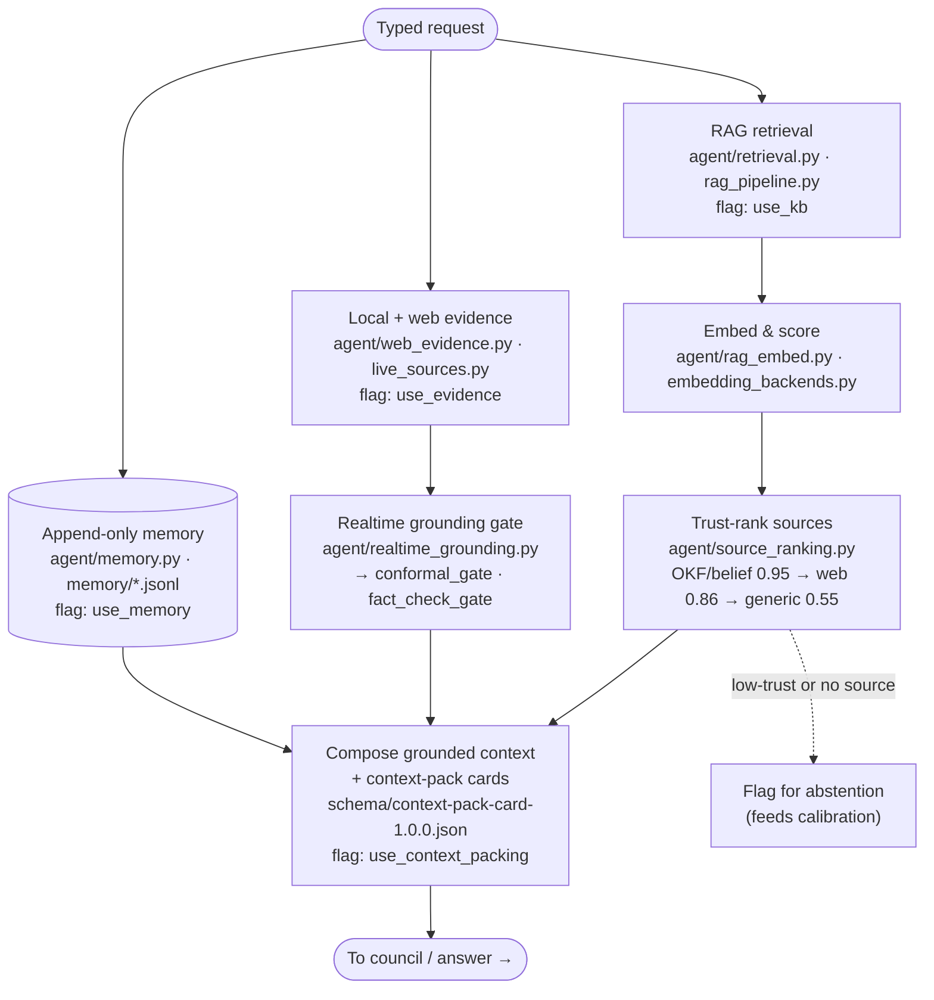
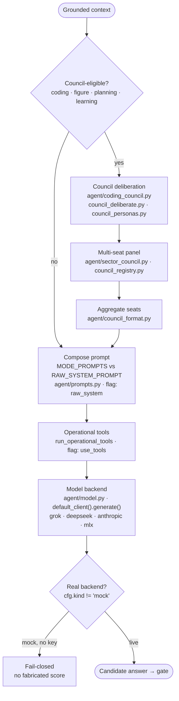
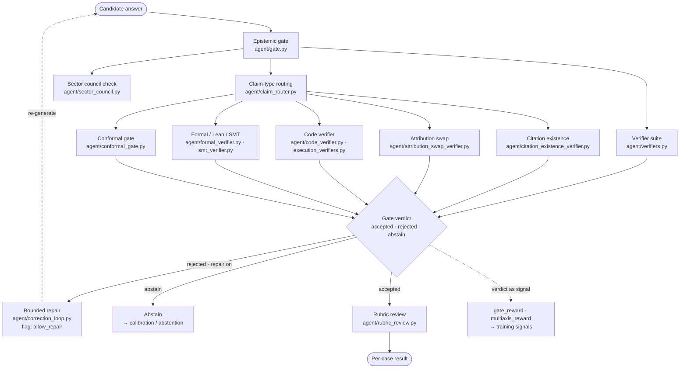
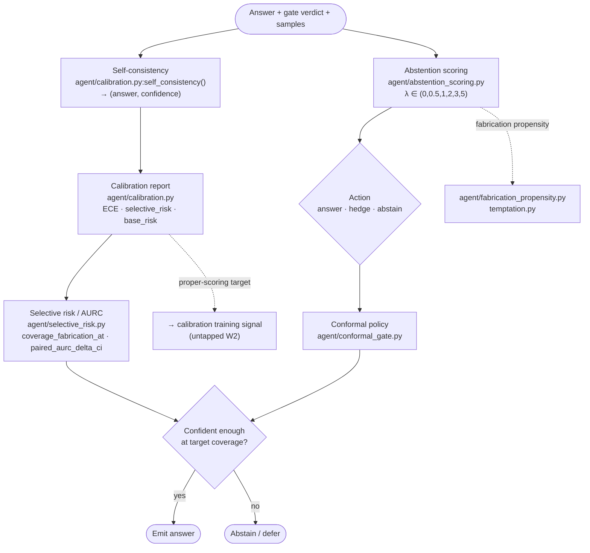
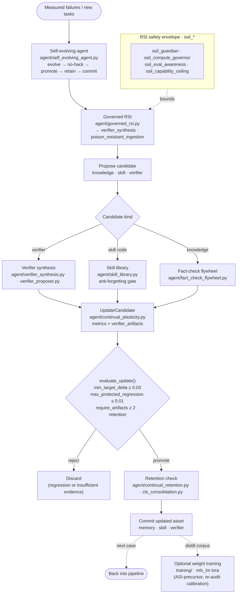
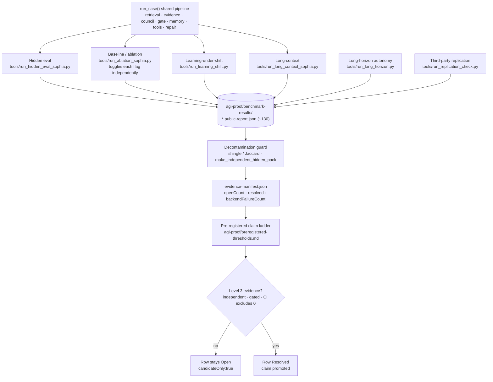
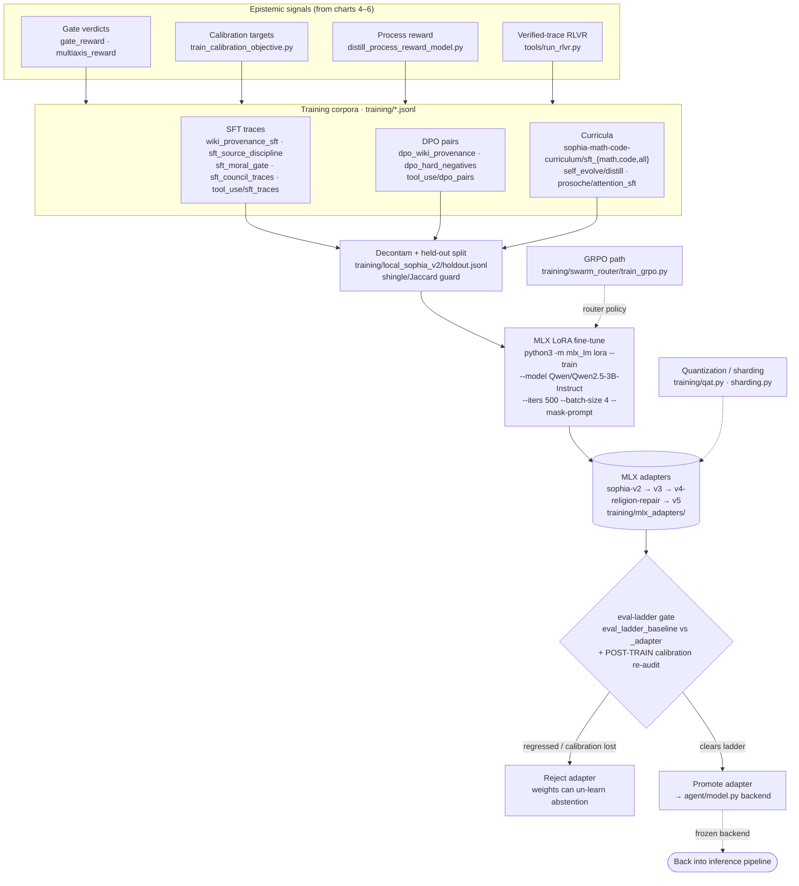

# Sophia — Combined Workflow Walk-through

> **Single-document tour of the whole system**, stitched from the per-subsystem charts in this folder. Built from the working clone (branch `feat/oscillatory-crosspollination` @ `4f1059a0`, 388 uncommitted local mods — may differ from any pushed commit; `origin/main` was `2cfa3c63` at build time, not verified against). Every node names a real file. For thesis use: each section's chart also exists as a standalone `.md`, and as `.png`/`.svg` under `png/` and `svg/`.

## How to read the system

Sophia is organised as **one per-case inference spine** wrapped by **two slower loops**. A case flows left-to-right through the spine (intake → grounded context → answer → epistemic gate → result). Around it sit the **proof harnesses** that measure the spine, and the **self-improvement loop** that turns measured failures into gated updates to memory, skills, and verifiers — and, only via an explicit training run, into model weights. The design invariant that makes the whole thing measurable: every spine step is a *suppressible* stage in one shared `run_case()`, which is why the ablation runner can price each component independently.

---

## 0 · Master chart — Sophia — Master Workflow Flowchart

One master chart that ties every Sophia subsystem together, plus links to the per-subsystem charts that expand each block. Built from the actual code in the working clone (the `run_case()` pipeline in `tools/run_hidden_eval_sophia.py`, the `agent/` module wiring, and `docs/09-Agent/Sophia-Architecture.md`) — not from a hand-drawn map. Every node names a real file.

---

## 1 · 1 · Intake & Routing

*The master spine's first block — **Intake & routing** — expands here.*

The front gate: turns a raw case into a typed, contract-checked request and decides which downstream paths (retrieval, council, claim-verification) it needs. Ablation flag `use_intake`. Suppressing it sends the raw query straight to context-gathering.

**Thesis note.** The intake contract is what makes every downstream step *suppressible and
measurable* — it stamps the request shape so the ablation runner can toggle each pipeline stage
independently. That toggle-ability is the basis of the whole baseline/ablation evidence story.

---

## 2 · 2 · Grounded Context (RAG + Evidence + Memory)

*The **Grounded context** block: what the model is given before it answers.*

Assembles the grounded context the model answers from: retrieved passages, local/web evidence, and prior memory — each with a provenance/trust tag. Ablation flags `use_kb` (retrieval), `use_evidence` (evidence), `use_memory` (memory).

**Thesis note.** Two traps worth stating in a methods chapter: (1) `rag_local_embed.py` is *also*
hash-based (`local-hash-v1`), so it is not a semantic upgrade over the lexical embedder — confirm the
live backend via `agent.vector_store.embedding_backend_id()`. (2) Source trust rank is deterministic
(`agent/source_ranking.py`), which is what lets provenance become a *weight* on downstream loss (see
the untapped-training W3 direction), not just a display tag.

---

## 3 · 3 · Council & Answer Generation

*The **Answer** block: council deliberation then the frozen model backend.*

Produces the candidate answer. For coding/figure/planning cases a multi-seat **council** deliberates before the model call; otherwise the composed prompt goes straight to the frozen model backend. Ablation flag `use_council`.

**Thesis note.** Two facts a reviewer will check: the real adapter is
`agent.model.default_client(spec).generate(system, user) -> ModelResult` (not a `complete(prompt)`
call), and `agent.model._auto_provider()` returns `"mock"` with no API key — mock `.generate()`
fabricates text at `ok=True`. Any measured claim must assert `cfg.kind != "mock"`. Council catch-rate
(1.0 vs 0.27 monolith) in the repo's reports is on *stub* seats — real trained discipline adapters are
a named open gap.

---

## 4 · 4 · Epistemic Gate & Verification

*The **Epistemic gate** — the master's first gold gate, and the largest subsystem (49 modules).*

The heart of the repo: after generation, the answer must pass an **epistemic gate** before it becomes a result. The gate composes many verifiers (claim-type, citation, code, formal/Lean, conformal) and can send a failing answer back for bounded repair. Ablation flag `use_gate`. This is the largest subsystem — 49 `agent/` modules.

**Thesis note.** The gate verdict is three-way (`accepted` / `rejected` / `abstain`), and the same
verdict is the seed for the training-signal path (`gate_reward.reward()`). That dual use — verdict as
inference-time gate **and** as a reward — is the bridge from "measured epistemics" to "learned
epistemics" (the untapped-training W1/W2 directions). `gate_reward` deliberately drops the question,
so as a raw reward it cannot tell abstain-on-answerable from abstain-on-trap — a known reward-hacking
surface worth naming.

---

## 5 · 5 · Calibration & Abstention

*The result feeds **Calibration & abstention**, entry to the self-improvement loop.*

Turns gate verdicts and confidence signals into a calibrated answer/abstain decision, and measures whether the system knows what it doesn't know. This is where the repo's validated headline result lives (self-consistency selective prediction). Feeds the self-improvement loop with the honesty signal.

**Thesis note.** This subsystem is measurement-only today: `calibration.py`,
`abstention_scoring.py`, and `selective_risk.py` contain **no differentiable loss** — they score, they
don't train. `abstention_scoring.py` cites Kalai et al. (*Why Language Models Hallucinate*) on the
binary-scoring incentive to guess (repo's own citation, not independently verified here). The largest
untapped lever in the whole repo is turning these proper-scoring metrics into an actual training
objective (W2) — the measurement→learning gap.

---

## 6 · 6 · Self-Evolution / RSI + Update Gate

***Self-evolution / RSI** — the master's green loop and its second gold gate (`evaluate_update`).*

The slow loop: turn measured failures into candidate improvements (knowledge, skills, verifiers), then **gate every promotion** through a protected-regression + retention check so the system improves without catastrophic forgetting — and without touching weights unless an explicit training run is invoked. 37 `agent/` modules, incl. the whole `ssil_*` safety family.

**Thesis note.** `evaluate_update()` is the repo's central safety primitive — a promotion is accepted
only if it clears a target-improvement floor **and** does not regress any protected metric beyond
tolerance, backed by ≥2 verifier artifacts. Today this loop improves *assets* (memory/skills/
verifiers), never weights. The dashed `WEIGHTS` edge is the one move that crosses into actual model
training (the SkillOpt-style skill→weight distillation, and W-series live runs) — and it is precisely
where the abstention the gate enforced can be un-learned, so post-distillation calibration re-audit is
mandatory.

---

## 7 · 7 · Evidence & Proof Harnesses

*The **proof harnesses** that measure the whole spine and gate every claim.*

The measurement layer. Every harness drives the *same* `run_case()` pipeline with different toggles/datasets, writes a `*.public-report.json`, and feeds the AGI-candidate proof package and its pre-registered claim ladder. This is what keeps claims honest: nothing is a result until a harness produces a decontaminated, gated report.

**Thesis note.** The design invariant worth foregrounding: every subsystem in charts 1–6 is a
*suppressible step* in one shared `run_case()`, which is exactly why the ablation runner can measure
each component's marginal contribution. Reports carry `candidateOnly` / `level3Evidence` /
`canClaimAGI` flags; a claim is promoted on the ladder only when an independent, decontaminated, gated
harness clears a pre-registered threshold with a CI excluding zero. This is the repo's answer to "how
do you prove an AGI-candidate claim without fooling yourself."

---

## 8 · 8 · Weight-Training Path (SFT / DPO / RLVR → MLX LoRA)

*The dashed **weight-training** crossover — the one path that changes model weights.*

The one path that changes **model weights** — the dashed `WEIGHTS` node in the master chart. Everything in charts 1–7 improves behavior without touching weights; this subsystem is where measured epistemic signals (gate verdicts, calibration, provenance) are distilled into training corpora and folded into a frozen base model via MLX LoRA. It is the ASI-precursor loop, and the point where inference-time safety must be re-audited post-training.

**Thesis note.** Three points a training-chapter reviewer will want stated: (1) the base is a **frozen
Qwen2.5-3B-Instruct** adapted only by LoRA — sophia does not pre-train. (2) The corpora are the
epistemic loop's *output* (provenance discipline, hard-negative abstention, moral-gate, council
traces) turned into supervision — this is the concrete measurement→learning bridge the W-series
proposes to complete. (3) The **post-training calibration re-audit** (the `EVALGATE` node) is not
optional: distilling gated *behaviors* into weights removes the inference-time gate that made them
safe, so an adapter must be re-checked for abstention/calibration regression before promotion, under
the same `candidateOnly` / `canClaimAGI:false` discipline as every other harness.

---

## Where the leverage is (for a thesis 'future work' section)

The recurring pattern across charts 4–8 is a **measurement→learning gap**: Sophia measures epistemics thoroughly (gate verdicts, calibration, provenance, fixed-point residuals) but rarely turns those measurements into a *training signal*. The highest-leverage moves — each a documented seam in the current code — are (1) the epistemic gate verdict as a process reward, (2) the calibration proper-scoring metric as an actual loss, (3) provenance rank as a per-example loss weight, and (4) the post-training calibration re-audit that keeps the weight-training path from un-learning the abstention the gate enforced. All four are additive to the pipeline and preserve the repo's honesty discipline (`candidateOnly` / `canClaimAGI:false` until a gated harness says otherwise).
